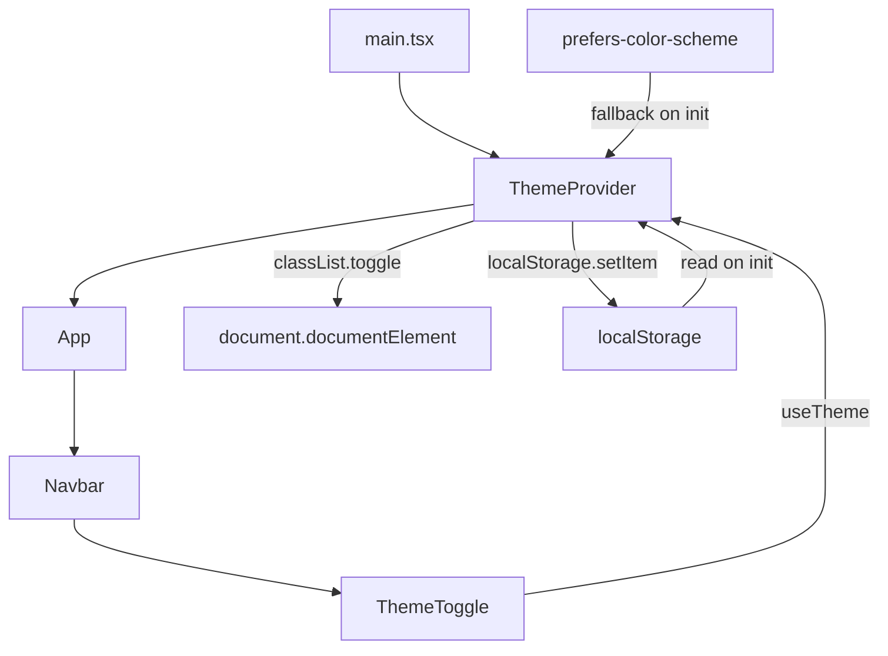

# Design Document: Theme Switching

## Overview

This design introduces a centralized theme management system for the Hazina frontend. The existing `ThemeToggle` component manages its own state in isolation; this feature extracts that logic into a shared `ThemeContext` + `useTheme` hook so any component can read or change the theme. The mechanism uses Tailwind's `class` dark mode strategy — toggling a `dark` class on `<html>` — and persists the user's choice in `localStorage`, falling back to the OS `prefers-color-scheme` preference on first visit.

## Architecture



The `ThemeProvider` is the single source of truth. It owns the `theme` state, syncs it to the DOM and `localStorage`, and exposes it via context. `ThemeToggle` is a pure consumer — it reads from and writes to the context only.

## Components and Interfaces

### ThemeContext (`frontend/src/context/ThemeContext.tsx`)

New file. Exports:
- `ThemeContext` — the React context object (internal, not exported for direct use)
- `ThemeProvider` — wraps children, owns state, syncs DOM/storage
- `useTheme` — hook that consumes the context; throws if used outside provider

```typescript
type Theme = 'dark' | 'light';

interface ThemeContextValue {
  theme: Theme;
  toggleTheme: () => void;
}
```

### ThemeToggle (`frontend/src/components/ThemeToggle.tsx`)

Existing file — refactored. Removes all local state and side effects. Becomes a thin consumer of `useTheme`.

### main.tsx

Wrap the existing provider tree with `<ThemeProvider>` as the outermost wrapper (inside `React.StrictMode`, outside everything else so all providers have access).

### tailwind.config.js

Add `darkMode: 'class'` at the top level of the config object.

## Data Models

### Theme type

```typescript
type Theme = 'dark' | 'light';
```

### localStorage schema

| Key | Values | Description |
|---|---|---|
| `"hazina-theme"` | `"dark"` \| `"light"` | Persisted user preference |

Any value other than `"dark"` or `"light"` is treated as absent and the OS preference is used instead.

### ThemeContextValue

```typescript
interface ThemeContextValue {
  theme: Theme;           // current active theme
  toggleTheme: () => void; // flips theme and persists
}
```

## Implementation Details

### Initialization order (prevents flash of wrong theme)

The initial theme value is computed synchronously before the first render:

```typescript
const STORAGE_KEY = 'hazina-theme';

function getInitialTheme(): Theme {
  const stored = localStorage.getItem(STORAGE_KEY);
  if (stored === 'dark' || stored === 'light') return stored;
  return window.matchMedia('(prefers-color-scheme: dark)').matches ? 'dark' : 'light';
}
```

The `useEffect` that applies the `dark` class to `document.documentElement` runs synchronously on mount (before paint in SSR-safe environments) and on every `theme` change.

### ThemeProvider implementation sketch

```typescript
export function ThemeProvider({ children }: { children: ReactNode }) {
  const [theme, setTheme] = useState<Theme>(getInitialTheme);

  useEffect(() => {
    document.documentElement.classList.toggle('dark', theme === 'dark');
    localStorage.setItem(STORAGE_KEY, theme);
  }, [theme]);

  const toggleTheme = useCallback(() => {
    setTheme(prev => prev === 'dark' ? 'light' : 'dark');
  }, []);

  return (
    <ThemeContext.Provider value={{ theme, toggleTheme }}>
      {children}
    </ThemeContext.Provider>
  );
}
```

### useTheme guard

```typescript
export function useTheme(): ThemeContextValue {
  const ctx = useContext(ThemeContext);
  if (!ctx) throw new Error('useTheme must be used within a ThemeProvider');
  return ctx;
}
```

### Refactored ThemeToggle

```typescript
export default function ThemeToggle() {
  const { theme, toggleTheme } = useTheme();
  const isDark = theme === 'dark';
  return (
    <button
      type="button"
      onClick={toggleTheme}
      aria-label={isDark ? 'Switch to light mode' : 'Switch to dark mode'}
      className="flex items-center justify-center p-2 rounded-full hover:bg-gold/10 focus:outline-none focus:ring-2 focus:ring-gold-light"
    >
      {isDark ? <Sun className="w-5 h-5" aria-hidden="true" /> : <Moon className="w-5 h-5" aria-hidden="true" />}
    </button>
  );
}
```

## Correctness Properties

A property is a characteristic or behavior that should hold true across all valid executions of a system — essentially, a formal statement about what the system should do. Properties serve as the bridge between human-readable specifications and machine-verifiable correctness guarantees.

Property 1: Toggle is an involution (round-trip)
*For any* initial theme value, calling `toggleTheme` twice should return the theme to its original value.
**Validates: Requirements 1.4**

Property 2: localStorage persistence on toggle
*For any* theme value, after calling `toggleTheme`, the value stored in `localStorage` under `"hazina-theme"` should equal the new theme value.
**Validates: Requirements 3.1**

Property 3: DOM class reflects theme state
*For any* theme value passed to `ThemeProvider`, the `dark` class on `document.documentElement` should be present if and only if `theme === "dark"`.
**Validates: Requirements 4.1, 4.2**

Property 4: localStorage initialization takes precedence over OS preference
*For any* stored value of `"dark"` or `"light"` in `localStorage`, the initialized theme should equal that stored value regardless of the `prefers-color-scheme` media query result.
**Validates: Requirements 3.2**

Property 5: Invalid localStorage values fall back to OS preference
*For any* string that is not `"dark"` or `"light"` stored in `localStorage`, the initialized theme should equal the OS preference (`"dark"` if `prefers-color-scheme: dark` matches, `"light"` otherwise).
**Validates: Requirements 3.3, 2.1, 2.2**

Property 6: useTheme outside provider throws
*For any* component that calls `useTheme` without a `ThemeProvider` ancestor, the hook should throw an error.
**Validates: Requirements 1.3**

## Error Handling

- `useTheme` called outside `ThemeProvider`: throws `Error('useTheme must be used within a ThemeProvider')`. This is a developer error caught at runtime during development.
- `localStorage` unavailable (e.g. private browsing with storage blocked): `getInitialTheme` should catch the `SecurityError` and fall back to `prefers-color-scheme`. The `useEffect` write should also be wrapped in a try/catch to silently ignore write failures.
- `window.matchMedia` unavailable (non-browser environment / SSR): guard with `typeof window !== 'undefined'` and default to `'dark'`.

## Testing Strategy

Testing uses **Vitest** + **@testing-library/react**.

### Unit tests

Cover specific examples and edge cases:
- `getInitialTheme` returns `"dark"` when `localStorage` has `"dark"`
- `getInitialTheme` returns `"light"` when `localStorage` has `"light"`
- `getInitialTheme` falls back to OS preference when `localStorage` is empty
- `getInitialTheme` falls back to OS preference when `localStorage` has an invalid value
- `useTheme` throws when called outside `ThemeProvider`
- `ThemeToggle` renders Sun icon when theme is `"dark"`
- `ThemeToggle` renders Moon icon when theme is `"light"`
- `ThemeToggle` has correct `aria-label` for each theme

### Property-based tests

Use **fast-check** (already compatible with Vitest) to validate universal properties. Each test runs a minimum of 100 iterations.

Each property test is tagged with a comment in the format:
`// Feature: theme-switching, Property N: <property text>`

- **Property 1** — Toggle involution: generate arbitrary initial theme, toggle twice, assert original value restored.
- **Property 2** — localStorage persistence: generate arbitrary theme, render provider, toggle, assert `localStorage.getItem("hazina-theme")` equals new theme.
- **Property 3** — DOM class reflects state: generate arbitrary theme, render provider, assert `document.documentElement.classList.contains("dark")` iff `theme === "dark"`.
- **Property 4** — Stored value takes precedence: generate `"dark"` | `"light"` as stored value, set OS preference to the opposite, assert initialized theme equals stored value.
- **Property 5** — Invalid stored value falls back: generate arbitrary string that is not `"dark"` or `"light"`, assert initialized theme equals OS preference.
- **Property 6** — useTheme outside provider throws: assert calling `useTheme` without provider always throws.

### Test file locations

- `frontend/src/context/ThemeContext.test.tsx` — hook and provider tests
- `frontend/src/components/ThemeToggle.test.tsx` — component tests
