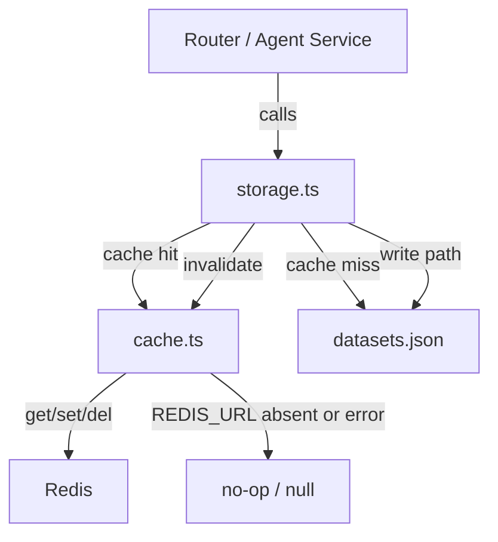

# Design Document: Redis Dataset Cache

## Overview

This design adds a thin Redis caching layer to the Hazina Data Escrow backend. The goal is to eliminate repeated synchronous `fs.readFileSync` calls on the three hot read paths — `GET /api/datasets`, `GET /api/datasets/stats`, and `GET /api/datasets/:id` — as well as the `getAllDatasets()` call inside the agent service research loop.

The implementation is intentionally minimal: a single `cache.ts` module wraps `ioredis`, and the existing `storage.ts` functions are augmented with cache-aside logic. No router code changes are required. When Redis is unavailable the system falls through to the file system transparently.

Key design decisions:
- **Cache-aside pattern** (read-through at the storage layer, not the router layer) keeps routers unchanged and makes the cache invisible to callers.
- **ioredis** is the Redis client because it is the de-facto standard for Node.js, has first-class TypeScript types, and supports `lazyConnect` + `enableOfflineQueue: false` for fast-fail graceful degradation.
- **No-op mode** when `REDIS_URL` is absent means the feature is opt-in per environment with zero risk to existing deployments.

---

## Architecture



The cache sits between the storage layer and Redis. The router and agent service are unaware of caching — they call the same `getAllDatasets()`, `getDataset()`, etc. functions as before.

---

## Components and Interfaces

### `cache.ts` — Cache Service

The sole new file. Exports a singleton Redis client (lazily initialised) and three typed helper functions plus a `CacheKeys` / `CacheTTL` constants object.

```typescript
// Public API of cache.ts

export const CacheKeys = {
  datasetList: (): string => 'haz:datasets:all',
  dataset: (id: string): string => `haz:dataset:${id}`,
  stats: (): string => 'haz:stats',
};

export const CacheTTL = {
  DATASET_LIST: 60,   // seconds
  DATASET: 120,       // seconds
  STATS: 30,          // seconds
};

export async function get<T>(key: string): Promise<T | null>;
export async function set(key: string, value: unknown, ttlSeconds: number): Promise<void>;
export async function del(...keys: string[]): Promise<void>;
export async function disconnect(): Promise<void>;
```

**Client initialisation** — the Redis client is created once on first use (lazy singleton). When `REDIS_URL` is absent the module exports no-op implementations that never touch Redis.

**ioredis options for graceful degradation**:
```typescript
new Redis(process.env.REDIS_URL, {
  lazyConnect: true,          // don't connect until first command
  enableOfflineQueue: false,  // reject commands immediately when disconnected
  maxRetriesPerRequest: 0,    // fail fast, don't retry individual commands
  connectTimeout: 2000,       // 2 s connection timeout
})
```

With `enableOfflineQueue: false` and `maxRetriesPerRequest: 0`, any Redis error surfaces immediately as a rejected promise, which the helpers catch and swallow — the caller receives `null` from `get` and a silent resolve from `set`/`del`.

An `error` event listener is attached to the client to prevent unhandled-rejection crashes:
```typescript
client.on('error', (err) => console.error('[Cache] Redis error:', err.message));
```

### `storage.ts` — Augmented Storage Layer

The existing functions are augmented with cache-aside logic. The changes are additive — no existing function signatures change.

**Read path (cache-aside)**:
```
get(key) → hit  → return parsed value
         → miss → readStore() → set(key, value, ttl) → return value
         → error → readStore() → return value
```

**Write path (invalidation)**:
```
writeStore() → del(affected keys)
```

Functions modified:
- `getAllDatasets()` — cache-aside with `CacheKeys.datasetList()`
- `getDataset(id)` — cache-aside with `CacheKeys.dataset(id)`
- `getTransactions()` with no `datasetId` argument — cache-aside with `CacheKeys.stats()`
- `addDataset()` — invalidates `datasetList` + `stats` after write
- `updateDataset()` — invalidates `dataset(id)` + `datasetList` + `stats` after write
- `addTransaction()` — invalidates `stats` after write

> `getTransactions()` with a `datasetId` argument (the per-dataset transaction list endpoint) is **not** cached — it is not a hot path and its result changes on every payment.

---

## Data Models

No new persistent data models are introduced. The cache stores serialised versions of existing types:

| Cache Key | Stored Type | TTL |
|---|---|---|
| `haz:datasets:all` | `Dataset[]` (JSON array, `data` field included) | 60 s |
| `haz:dataset:{id}` | `Dataset` (JSON object, `data` field included) | 120 s |
| `haz:stats` | `{ datasets: Dataset[], transactions: Transaction[] }` | 30 s |

The `data` field is included in the cached `Dataset` objects because `getDataset()` is also called by the agent service which needs the raw data. The router strips the `data` field before sending responses — that stripping happens at the router layer and is unaffected by caching.

The stats cache stores the raw arrays rather than the computed stats object so that the computation (reduce) happens at read time, keeping the cache consistent with the storage layer's existing logic.

---

## Correctness Properties

*A property is a characteristic or behaviour that should hold true across all valid executions of a system — essentially, a formal statement about what the system should do. Properties serve as the bridge between human-readable specifications and machine-verifiable correctness guarantees.*

Property 1: Cache round-trip
*For any* cache key and serialisable value, calling `set(key, value, ttl)` followed by `get(key)` should return a deeply equal value.
**Validates: Requirements 1.1, 1.2**

Property 2: Del invalidates cached value
*For any* cache key and value, after calling `set(key, value, ttl)` then `del(key)`, calling `get(key)` should return `null`.
**Validates: Requirements 1.3**

Property 3: No-op mode — get always returns null
*For any* cache key, when `REDIS_URL` is absent, `get` should always return `null` without throwing.
**Validates: Requirements 1.5, 5.2**

Property 4: Graceful degradation on Redis error
*For any* cache key and value, when the Redis client throws during `get`, the Cache_Service should return `null`; when it throws during `set`, the Cache_Service should resolve without throwing.
**Validates: Requirements 1.6, 6.1, 6.4**

Property 5: Cache key contains dataset ID
*For any* non-empty dataset ID string, `CacheKeys.dataset(id)` should produce a string that contains the ID verbatim.
**Validates: Requirements 2.3**

Property 6: Cache hit avoids file system read
*For any* dataset array (for `getAllDatasets`) or dataset object (for `getDataset`), when the value is already in the cache, calling the storage function should return the cached value and the file system should be read zero additional times.
**Validates: Requirements 3.1, 3.3**

Property 7: Cache miss populates cache
*For any* dataset array, when the cache is empty, calling `getAllDatasets()` should read the file system once and then store the result in the cache so a subsequent call does not read the file system again.
**Validates: Requirements 3.2, 3.4**

Property 8: Storage graceful degradation
*For any* dataset array, when the Cache_Service returns `null` (no-op mode or Redis error), the storage functions should still return the correct data from the file system with no change in return type or thrown exceptions.
**Validates: Requirements 3.6, 6.2**

Property 9: addDataset invalidates list and stats cache
*For any* dataset, after calling `addDataset()`, the cache `del` function should be called with both `CacheKeys.datasetList()` and `CacheKeys.stats()`.
**Validates: Requirements 4.1**

Property 10: updateDataset invalidates individual, list, and stats cache
*For any* dataset ID and update payload, after calling `updateDataset(id, updates)`, the cache `del` function should be called with `CacheKeys.dataset(id)`, `CacheKeys.datasetList()`, and `CacheKeys.stats()`.
**Validates: Requirements 4.2**

Property 11: addTransaction invalidates stats cache
*For any* transaction, after calling `addTransaction()`, the cache `del` function should be called with `CacheKeys.stats()`.
**Validates: Requirements 4.4**

Property 12: Invalidation failure does not propagate
*For any* write operation (`addDataset`, `updateDataset`, `addTransaction`), if the cache `del` call throws, the storage function should still resolve successfully without re-throwing the error.
**Validates: Requirements 4.3**

---

## Error Handling

| Scenario | Behaviour |
|---|---|
| `REDIS_URL` not set | No-op mode; single log at startup; all reads fall through to file system |
| Redis connection refused at startup | `lazyConnect` defers connection; first command fails fast; `get` returns `null` |
| Redis goes down mid-operation | `enableOfflineQueue: false` causes immediate rejection; caught by helpers; falls through to file system |
| Redis reconnects | ioredis auto-reconnects; caching resumes automatically |
| `get` returns malformed JSON | `JSON.parse` throws; caught; returns `null`; falls through to file system |
| Cache invalidation fails on write | Error logged; write to file system already succeeded; no rollback |

---

## Testing Strategy

### Tooling

- **Test runner**: vitest (already in use)
- **Property-based testing**: `@fast-check/vitest` — integrates fast-check with vitest's `it` / `test` API
- **Redis mocking**: `vi.mock('ioredis', ...)` with a manual in-memory stub; no real Redis required

### Unit Tests (`cache.test.ts`)

Focus on the Cache_Service in isolation with a mocked Redis client:
- `get` returns deserialised value on hit
- `get` returns `null` on miss (Redis returns `null`)
- `get` returns `null` when Redis throws
- `set` calls Redis `setex` with correct key, TTL, and JSON-serialised value
- `set` resolves silently when Redis throws
- `del` calls Redis `del` with all provided keys
- No-op mode: `get` returns `null`, `set` and `del` resolve without calling Redis

### Integration Tests (`storage.test.ts` additions)

Focus on the augmented storage functions with a mocked cache module:
- `getAllDatasets()` reads file system once on cache miss, returns cached value on second call
- `addDataset()` calls `del` with `datasetList` and `stats` keys
- `updateDataset()` calls `del` with `dataset(id)`, `datasetList`, and `stats` keys
- `addTransaction()` calls `del` with `stats` key

### Property-Based Tests

Using `@fast-check/vitest` with `fc.property` / `test.prop`:

Each property test runs a minimum of 100 iterations.

Tag format: `// Feature: redis-dataset-cache, Property {N}: {title}`

**Property 1** — Cache-aside read consistency
Generate: arbitrary `Dataset[]`; seed the mock cache with the serialised array; call `getAllDatasets()` twice; assert file read count = 1 and both results are deeply equal.

**Property 2** — Single-dataset cache-aside consistency
Generate: arbitrary `Dataset`; seed mock cache; call `getDataset(id)` twice; assert file read count = 1 and both results are deeply equal.

**Property 3** — Write invalidates list cache
Generate: arbitrary `Dataset`; call `addDataset()`; assert mock cache `del` was called with `CacheKeys.datasetList()`.

**Property 4** — Write invalidates individual dataset cache
Generate: arbitrary `Dataset` + arbitrary `Partial<Dataset>` updates; call `updateDataset()`; assert mock cache `del` was called with `CacheKeys.dataset(id)`.

**Property 5** — Stats invalidated on transaction write
Generate: arbitrary `Transaction`; call `addTransaction()`; assert mock cache `del` was called with `CacheKeys.stats()`.

**Property 6** — Graceful degradation on get error
Generate: arbitrary cache key string; configure mock Redis to throw; call `cache.get(key)`; assert result is `null` and no exception propagates.

**Property 7** — Graceful degradation on set error
Generate: arbitrary key + value; configure mock Redis to throw; call `cache.set(key, value, 60)`; assert promise resolves without throwing.

**Property 9** — Cache key contains ID
Generate: arbitrary non-empty string ID; assert `CacheKeys.dataset(id).includes(id)`.

> Properties 6 and 7 are combined into a single "graceful degradation" property test since they share the same generator and setup.

### Unit Test Balance

Unit tests cover specific examples and edge cases (empty arrays, missing IDs, malformed JSON from Redis). Property tests handle the universal correctness claims. Both are required — unit tests catch concrete bugs, property tests verify general correctness across the input space.
